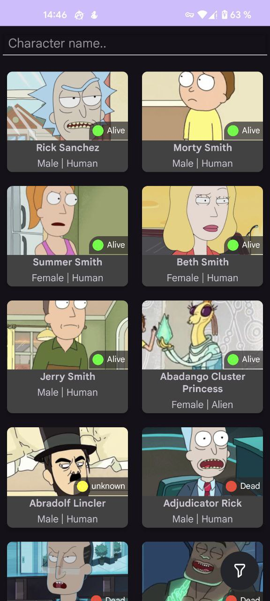
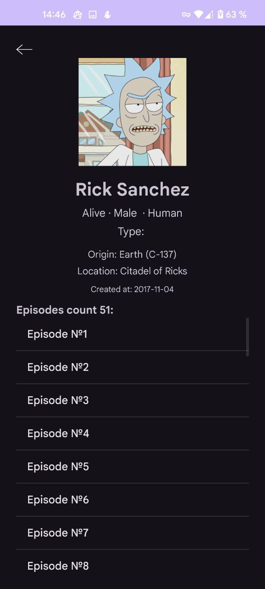

# :notebook_with_decorative_cover: Содержание

- [:notebook\_with\_decorative\_cover: Содержание](#notebook_with_decorative_cover-содержание)
- [Rick and Morty Wiki](#rick-and-morty-wiki)
  - [:star2: О проекте](#star2-о-проекте)
  - [Важные технические заметки (TODO):](#важные-технические-заметки-todo)
  - [:camera: Снимки экрана](#camera-снимки-экрана)
  - [:space\_invader: Технологический стек](#space_invader-технологический-стек)
  - [:dart: Фичи](#dart-фичи)
  - [:warning: Лицензия](#warning-лицензия)

# Rick and Morty Wiki

## :star2: О проекте

Rick and Morty Wiki — Android-приложение с функцией поиска, фильтрации и просмотра информации о персонажах вселенной "Рик и Морти". Реализован оффлайн-доступ через Room и синхронизация с публичным API с помощью Paging 3 и RemoteMediator. Приложение разработано с использованием современных подходов к архитектуре Android.

## Важные технические заметки (TODO):
В коде ищется как `TODO (#n)`
- **#1:** В `RemoteMediator` используется упрощённый хак с переменной `currentPage` для пагинации, вместо создания отдельной таблицы remoteKeys. Работает, но требует улучшения.
- **#2:** В передаче данных между активностями лучше передавать идентификатор персонажа, а не сериализованную структуру целиком, чтобы избежать лишних ошибок и повысить производительность.  
- **#3:** Объект `CharacterSearchQuery` создаёт много временных объектов (~50-60 байт каждый), что может нагружать сборщик мусора. Решение — сделать поля `var` и переиспользовать один объект, чтобы уменьшить нагрузку.  
- **#4:** Для отображения списка эпизодов используется `ListView`, что проще, но менее эффективно. Возможен переход на `RecyclerView` для лучшей производительности и гибкости.

## :camera: Снимки экрана
|                              |                                  |
| ---------------------------- | -------------------------------- |
|  |      |
| Список персонажей            | Детальная информация о персонаже |
|  |                                  |
| Диалог фильтрации            |                                  |

## :space_invader: Технологический стек

- **Room** — локальное кэширование и поиск
- **Retrofit + Gson** — сетевой слой и парсинг JSON
- **Paging 3 + RemoteMediator** — постраничная загрузка и кэширование
- **Hilt (Dagger)** — внедрение зависимостей
- **Kotlin Coroutines / Flow** — асинхронность
- **Picasso** — загрузка изображений

## :dart: Фичи
- **Поиск по имени** — результат виден моментально
- **Фильтрация по статусу, полу, типу, виду** — через диалог фильтра
- **Кэширование** — даже без интернета можно просматривать сохранённых персонажей
- **Постраничная загрузка** — плавная прокрутка без задержек
- **Архитектура MVVM + Hilt** — масштабируемость и читаемость

## :warning: Лицензия
  MIT LICANSE
